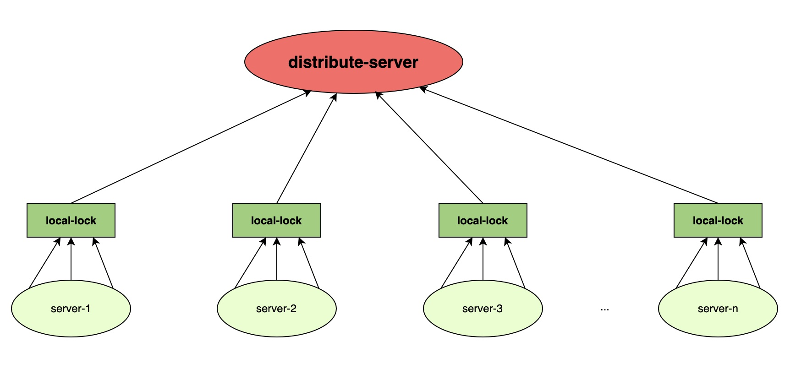

# Local First Distribute Lock

Local first distribute lock aimed to reduce distribute-lock-server's concurrency pressure by using local lock first.As illustrated in figure 1, when a request want to fetch distribute lock, this request must first fetch JVM lock(local lock).By doing this, for a specific lock key, the distribute-lock-server will only bear a fixed number of concurrent machines, rather than requesting concurrent requests.

  figure 1

This project provides support for several different types of distributed locks, including reentrant read-write lock, reentrant lock, spin lock, and simple lock:
- read-write lock: a reentrant read/write lock.
- reentrant lock: a common lock that can be reentrant.
- spin lock: reentrant lock, does not rely on message notifications (watch mechanism, message subscription), obtains lock based on local spin.
- simple lock: Cannot re-enter lock, does not block, does not wait, fails to obtain, immediately returns false.

This project was not started from scratch, but combined with existing distributed locks.Specifically, as follows.
## Combine with zookeeper
This combination provides the following capabilities:
### readWriteLock
### lock
### simpleLock
## Combine with redisson
This combination provides the following capabilities:
### readWriteLock
### lock
### spinLock
### simpleLock
## Combine with db
This combination provides the following capabilities:
### spinLock
### simpleLock